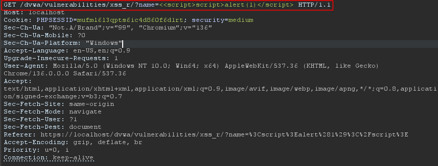
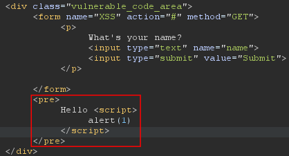

```
Reported by: Mikail Kakabayev (nulbyt3)
Date: 2025/23/07

 ---------- Details ----------
Lab: DVWA (Damn Vulnerable Web Application)
Vulnerability: Reflected Cross-Site Scripting (XSS)
Security Level: Medium
Endpoint: https://localhost/dvwa/vulnerabilities/xss_r/?name=
```

## <span style='color: red'>Vulnerable:</span> Reflected Cross-Site Scripting (XSS) in Search Parameter

### Description:
A reflected Cross-Site Scripting (XSS) vulnerability exists in the DVWA application's "XSS Reflected" module. The name parameter in the search function does not properly sanitize user input, allowing arbitrary JavaScript execution.

### Impact:
An attacker could:
- Steal user sessions (e.g., cookies via `document.cookie`).
- Redirect users to malicious sites.
- Perform actions on behalf of the victim.

### Steps to Reproduce:
1. Navigate to: `https://localhost/dvwa/vulnerabilities/xss_r/name=`
2. Try to inject following payload into the `name` parameter:
```js
<<script>script>alert(1)</script>
```
3. The browser executes the injected `alert(1)` script.  

- check the testing process => [How i tested](./XSS_dvwa_medium.md)

### Proof of Concept (PoC):
1. Try to change the name input into `<<script>script>alert(1)</script>`:



2. Inspect the HTML code and navigate to elements tab and check the `<pre />` tag:



### Prevention Techniques:
1. Input Sanitization:
    -  (NodeJS) use express-validator and CSP headers to block inline scripts `(alert(1))`  
    ```javascript
    const express = require('express');
    const { body, validationResult } = require('express-validator');
    
    const app = express();
    app.use(express.urlencoded({ extended: true }));
    
    // Sanitize GET parameter
    app.get('/vulnerabilities/xss_r', 
      [
        query('name').escape() // Escapes HTML tags (e.g., <script> → &lt;script&gt;)
      ],
      (req, res) => {
        const errors = validationResult(req);
        if (!errors.isEmpty()) {
          return res.status(400).send("Invalid input");
        }
        const safeName = req.query.name;
        res.send(`Hello, ${safeName}`); // Safe output
      }
    );

    app.listen(3000);
    ```
    
    ```javascript
    const helmet = require('helmet');
    app.use(helmet.contentSecurityPolicy({
      directives: {
        defaultSrc: ["'self'"],
        scriptSrc: ["'self'"], // Blocks inline scripts like alert(1)
      }
    }));
    ```
2. Output Encoding:
    - *If you must render user input in HTML:* 
        - (Javascript) Use `textContent` instead of `innerHTML`
        - (Template Engines) EJS/Ninja2  

```javscript
<!-- Safe in EJS (Node.js) -->
<p><%- userInput %></p>  <!-- Auto-escaped -->
```

3. Use HTTP-Only Cookies to prevent JS from accessing cookies via `document.cookie`.
4. Input Whitelisting:  
    - Only allow alphanumeric chars (e.g., `/[^a-zA-Z0-9]/g`)  
5. DOM Purify (Frontend):  
    - Sanitize HTML => `DOMPurify.sanitize(userInput)`
