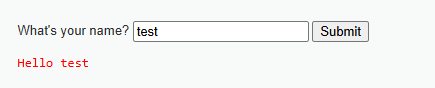
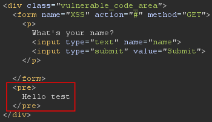
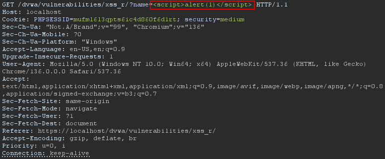
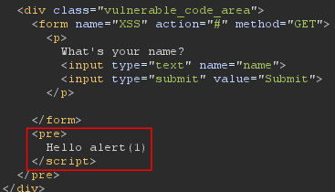
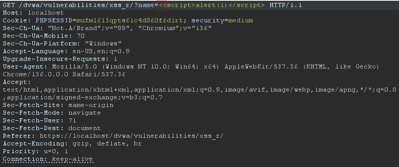
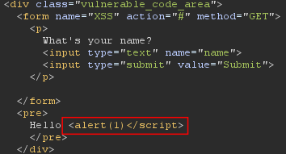
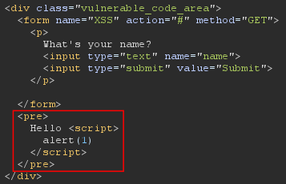

```
Tested by: Mikail Kakabayev (nulbyt3)
Date: 2025/23/07

---------- Details ----------
Lab: DVWA (Damn Vulnerable Web Application)
Vulnerability: Reflected Cross-Site Scripting (XSS)
Security Level: Medium
Endpoint: https://localhost/dvwa/vulnerabilities/xss_r/?name=
```

## Testing Process
1. Entered a basic test string (test) into the search input to observe normal behavior.


2. Check how the input has reflected using BurpSuite (or inspect the page from the Browser).


3. Then I tried to execute a script, but it sanitizing the HTML tags and removed/stripped the `<script /> ` tags.  



4. I added extra `<` to the start, and it covered the `alert(1)` text as HTML tag.



5. Finally, I can trick the application adding `<<script>script>alert(1)</script>`  
    - By such payload, The payload going to work even if it sanitize the HTML tag and it shows the alert pop-up. 


